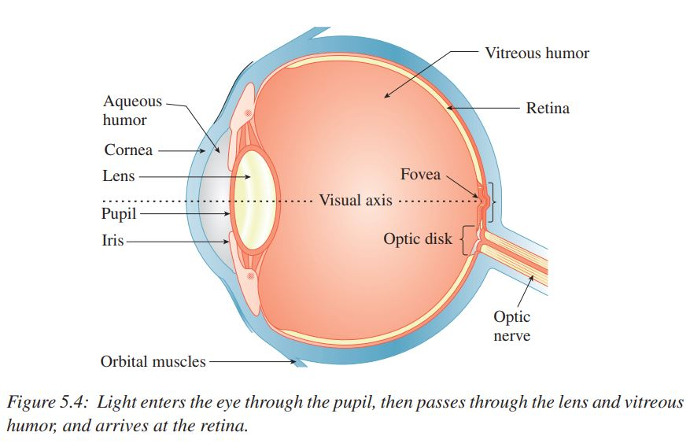
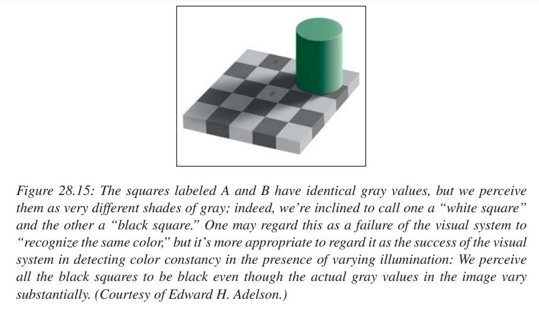

## graphics community
- raster graphics
- vector graphics

## displayed size
create a mapping between physical and abstract
- millimeters and typograhic points
- application-determined semantics

## Immediate-Mode versus Retained-Mode
IM advantages: maximum performance, minimum resource

RM advantages: reusable components, retain the scene graph and modify it

|    | IM             |           RM       |
|----|:---------------|:------------------:|
| 2D | Java awt.Graphics2D
Apple Quartz
2G GDI+ | Microsoft WPF 2D |
| 3D | OpenGL
DirectX | Microsoft WPF 3D |

# Human Visual Perception
The visual system is both tolerant of bad data and sensitive.

## components
- eye
- optic nerve 视神经
- visual cortex 视觉皮层
    * early vision
    * later regions

## components运作方式
- 宏观上有一个pipeline结构
- 但也有很多并行处理，也会从later regions向early vision反馈信息

## well tasks vs. less well tasks
### well tasks
- 在任意视角和距离判断大小和方向
- 识别颜色可以不随光照条件的变化而变化， 例如光暗了，就把黄色看成绿色
- 识别形状，即使有背景干扰和扭曲
  
## less well tasks
- 判断绝对亮度
- 识别平行线
- 检测相同但没有邻接的颜色
  
总而言之，visual system擅长和不擅长的都是进化的结果

## Optical illusions
- **What is obvious is not necessarily true.**
- **The end result of vision is a construction created by the mind, and not objective reality.**

## Sum-squared Difference(L^2 difference or L^2 distance, 欧氏距离)
41 x 41 pixels 
A image, all pixels value 118
B image, all pixels value 128
C image, all pixels value 128, except the center 255
Distance(A-B) = sqrt(10^2 * 41^2) = 410
Distance(A-C) = sqrt(10^2 * (41^2 - 1) + (255-118)^2) = 432.16

### something about our visual system
1. Our perception of things is fairly independent of lighting.
2. The early portions of the visual system tend to detect edges and assemble them into something that the brain perceives as a whole.

### Eye
#### physical characteristics limits of eyes
- smallest detectable brightness difference
- smallest angular resolution 

#### Physical

- Aqueous humor: 房水
- Cornea: 角膜
- Lens: 镜头
- Pupil: 瞳孔
- Iris: 虹膜
- Visual axis: 视轴
- Vitreous humor: 玻璃体
- Retina: 视网膜
- Fovea: 中央凹
- Optic disk: 视盘 
- Optic nerve: 视神经

视觉细胞：
- 杆细胞：微暗光检测
- 锥细胞：明亮光检测， 分三种，它们结合起来形成颜色视觉

人的视觉系统的对数响应机制：人感知的明亮度跟光的辐射量的对数成正比

the visual system's ability to detect distance to an object through two different mechanisms
1. 眼睛可以聚焦，双眼同时可以定位物体的深度
- 3D glasses
2. 眼睛对周围环境的光线的适应性和有限的动态范围，意味着我们不需要构建像素间对比度很大的显示器

#### 侧向抑制效应和马赫带效应

对图形学的影响：flat mode, smooth mode

#### 眼睛自适应功能具有**区域局部性**

眼睛可辨识局部区域内大约100:1的亮度差异。

从无灯光的室内透过小窗户向阳光明媚的室外凝视，眼睛可以辨识室内100:1的亮度差异（局部暗光），
也可以辨识室外100:1的亮度差异（局部亮光）

白天最亮的光照亮度和夜晚最暗的光照亮度之比可超过1,000,000:1

太阳：-26.7
满月：-12.8
天狼星：-1.44

极端例子： 一颗3等星和月亮的亮度差大约为1,000,000倍, 为什么当它们在视野内很近的时候，肯定看不到
3等星？

#### 恒常性
- 颜色恒常性
- 形状恒常性
- 大小恒常性
- 亮度恒常性

对于亮度，相对亮度比绝对亮度更重要。

- 延续性
- 阴影
