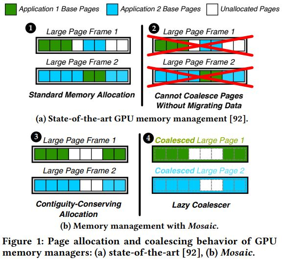

Notes for Mosaic: A GPU memory manager with application transparent support for multiple page sizes

This article is published in 2017 50th Annual IEEE/ACM International Symposium on Microarchitecture.
The date of conference is Oct. 14-17, 2017

# 现代GPU内存管理的问题

## Address Translation and Demand Paging Undermine TLP

虚拟地址空间简化了GPU编程，但虚地址物理地址转换和缺页会带来巨大的性能开销。而且GPU依赖
的就是线程级并行(TLP)去隐藏访存时延，地址转换和缺页都会破坏TLP

1. A single miss in the TLB invokes an expensive serialized page table walk that often
stalls multiple threads.

2. Multiple threads often stall when they wait for an expensive data transfer over the
system I/O bus when the GPU demands a page.

## Page Size Trade-off

内存管理中的页大小会影响address translation和demand paging的开销，页面大小是需要权衡的
问题

简单说，内存页面越大，address translation开销越小，因为页越大，页表项就越少，TLB miss
的概率就越小；但demand paging的开销是相反的，页越小，demand paging的开销越小，因为越小
的页就意味着越小的I/O传输时延

# 如何解决上述问题

Multiple page size可以同时兼顾address translation和demand paging的开销。但Multiple page
size又会带来两个问题

- page coalescing: merging base pages into a large page
- page splintering: splitting a large page into base pages

page coalescing and splintering都会有base page migration(data migration)，如何避免data
migration又是一个问题

# Mosaic是怎样解决在multiple page size的情况下,没有数据转移的情况下合并base pages为large page

## Key Ideas
1. use base pages(e.g. 4KB) to transfer data over system I/O bus
2. allocate physical base pages in a way that avoids the need to migrate data during coalescing
    - perserves base page contiguity
    - ensures that a large page frame contains pages from only a single memory protection domain
3. use a simple coalescing mechanism to combine base pages into large pages(e.g. 2MB)

## Key Components
1. Contiguity-Conserving Allocation(CoCoA)
2. In-Place Coalescer

a page size selection mechanism that merges base pages into a large page immediately after
allocation, and thus does not need to monitor base pages to make coalescing decisions or
migrate base pages.

3. Contiguity-Aware Compaction(CAC)

a memory compaction mechanism that transparently migrates data to avoid internal fragmentation
within a large page frame, which frees up large page frames for CoCoA.

## in-place page size selection mechanism

1. 让TLB使用large page，以减少address translation的开销
2. 在数据传输的时候，让GPU只传输应用程序需要的base pages，以减小demand paging的开销

## 

虚拟内存的核心特点就是应用之间安全地共享物理内存，不同的应用程序拥有各自独立的虚拟地址空
间，给定一个应用程序，它的虚拟地址空间所映射的物理base pages是否是物理连续的?这是一个关键
问题。反过来说，如果一块物理内存，它所包含的所有base pages都属于同一个虚拟地址空间，那么它们就
可以被合并为一个large page，而不需要有data migration.

